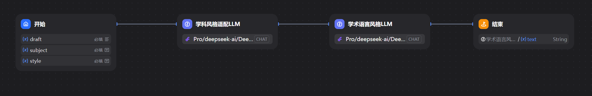
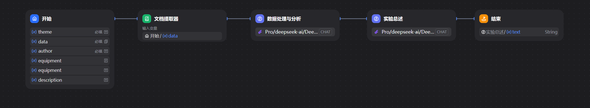
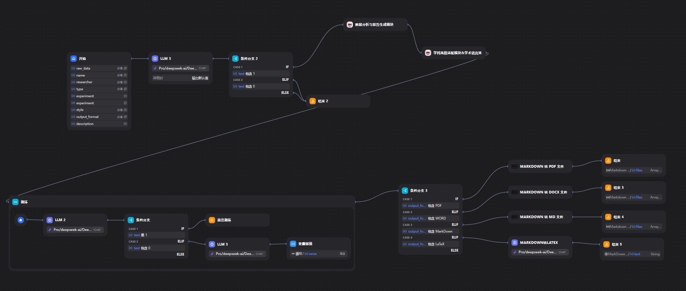

# ReportEase：多模块智能实验报告写作系统

本项目为人工智能基础课程的大作业，基于低代码平台 Dify 开发，实现了从实验数据处理到学术报告撰写的一站式自动化流程。

## 🎯 项目目标

通过模块化设计与大语言模型（LLM）能力，自动完成以下任务：

- 实验数据解析与分析
- 自动生成结构完整的实验报告草稿，包括实验目的、数据、分析、结论等内容
- 学科风格适配（如物理/化学/生物等）
- 学术语言风格调节（如正式、精炼、描述性等）
- 输出报告支持多种格式导出，如PDF，Word，LaTeX代码等

---

## 🧩 模块结构

本系统采用模块化设计，共包含六个功能明确、相互协同的子模块，确保从原始实验数据输入到高质量报告导出的全流程自动化完成：

### 1️⃣ 实验信息输入与校验模块

- **功能**：
  - 接收用户输入的实验主题、数据文件、作者信息、设备信息等内容；
  - 自动判断是否缺失关键字段或文件，防止后续流程报错。
- **特点**：
  - 图形化表单式输入界面；
  - 可选文件上传：支持图片（如实验装置图）、数据文件（如 CSV、Excel、图像）；
  - 字段约束与错误提示友好清晰。

### 2️⃣ 实验数据分析模块

- **功能**：
  - 自动解析上传的实验数据；
  - 对数据内容进行结构化提取、表格生成、可视化分析与结果归纳。
- **特点**：
  - 使用文档提取器 + 大语言模型协作；
  - 产出清晰的数据表格与文字分析；
  - 可用于后续报告内容拼接。

### 3️⃣ 报告生成模块

- **功能**：
  - 将实验信息、数据分析结果自动组合为结构完整的实验报告 Markdown 草稿；
  - 报告内容涵盖实验目的、仪器原理、数据、结果与结论。
- **特点**：
  - 报告结构固定标准（便于 LaTeX 渲染）；
  - 自动补全缺失部分（如实验原理）；
  - 支持 LaTeX 风格的 Markdown 语法，便于转换为 `.pdf`、`.docx` 等格式。

### 4️⃣ 学科风格适配模块

- **功能**：
  - 根据用户提供的学科领域（如物理、化学、生物等），调整术语与语言表达风格；
  - 确保报告用词准确、风格符合专业规范。
- **特点**：
  - 由预设提示词驱动 LLM 识别风格差异；
  - 不改变结构，仅替换用词/表达习惯；
  - 增强报告的专业性与可信度。

### 5️⃣ 学术语言风格调节模块

- **功能**：
  - 根据用户指定语言风格（如正式、精炼、描述性等），对报告进行语言层面润色；
  - 提升句式优雅性、逻辑清晰度与可读性。
- **特点**：
  - 严格保留原有报告层级结构与标题；
  - 仅润色语言表达，不添加或删减内容；
  - 输出纯净的 Markdown 源文，无解释或注释内容。

### 6️⃣ 报告格式校验与导出模块

- **功能**：
  - 检查最终 Markdown 内容是否满足格式规范；
  - 支持导出为 PDF、Word、LaTeX代码 等多种格式；
- **特点**：
  - 内置 LaTeX 编译兼容性检查（避免非法公式格式）；
  - 支持图像与公式自动嵌入；
  - 可用于课程报告提交、科研论文初稿生成等场景。

---

## 📁 工作流配置说明（`workflows/` 文件夹）

本项目使用 Dify 的工作流系统进行模块逻辑配置，所有流程均以 `.yml` 格式存储于 `workflows/` 文件夹中。以下是各工作流文件的说明：

### 🧠 `学科风格适配模块与学术语言风格调节模块.yml`

- 包含两个串联的子模块：
  - **学科风格适配模块**：根据指定学科（如物理、化学等）调整术语与写作风格；
  - **学术语言风格调节模块**：对实验报告语言进行润色，使表达更正式、精炼或描述性。
- **输入**：报告草稿、目标学科、语言风格类型  
- **输出**：风格一致、表达规范的最终 Markdown 实验报告

### 📊 `数据分析与报告生成模块.yml`

- 涵盖从数据输入到报告初稿生成的完整流程：
  - 自动提取上传的实验数据；
  - 生成数据表格、分析结果与结论；
  - 自动撰写结构完整、可 LaTeX 渲染的 Markdown 实验报告初稿。
- **输入**：实验数据文件、实验主题、作者、实验设备（可选）  
- **输出**：标准化 Markdown 实验报告草稿

### 🧩 `实验报告生成器.yml`

- **项目总控模块**，用于将前两个模块串联，并整合输入校验、输出验证等功能：
  - 统一接收用户输入；
  - 串联数据分析与风格调节模块；
  - 保证最终输出满足格式规范并适配多格式导出（PDF、DOCX、LaTeX 等）。
- **功能特点**：
  - 模块化封装；
  - 输入完整性验证；
  - 输出结构和语义双重合规

📌 所有 `.yml` 文件均可在本地或 Dify 控制台中导入使用，也支持导出与共享。

---

## 🚀 使用方式

